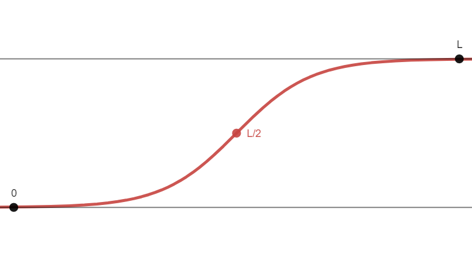

# Logistic Growth - Ethan Harvey

## is it just me or do they look like elongated integration symbols
###### they totally do

---

## quick equation reference

$$ \frac{dy}{dt} = ky(L-y) \;\;\text{ or }\;\; \frac{dy}{dt}= kyL -ky^2$$
$$ y= \frac{L}{1+Ce^{-Lkt}} $$
*(Recall: "Lice minus licked")*

Where:

- $L$ = Carrying Capacity
- $k$ = Growth Rate
- $C$ = Controls y-intercept (not directly)
    - Exact starting value at $\frac{L}{1+C}$, from simply saying $e^0 = 1$

Also recall that the fastest growth rate occurs at $y=\frac{L}{2}$.

## ok so what're these about again

You've got something that wants to grow in an exponential fashion, but it's limited by some carrying capacity (e.g. there's a limited food supply, limited space, maximum logical amount, etc.). As you take the limit as $t \rightarrow \infty$, this function will trend towards that carrying capacity $L$.

If you just wanna play with the variables, [here's](https://www.desmos.com/calculator/5ffwdnnds1) a quick desmos graph.

## example time as a quick refresher (which i totally didn't steal from our homework)

The rate at which the flu spreads in a community is modeled by:
$$\frac{dP}{dt} = 0.001P(3000-P)$$
Where $t$ is measured in days.

1. If $P(0) = 50$, solve for P as a function of $t$ (aka get the actual logistic)

$$P(t) = \frac{3000}{1+Ce^{-(3000(0.001))t}}$$
$$P(t) = \frac{3000}{1+Ce^{-3t}}$$
Given $P(0) = 50$,
$$50 = \frac{3000}{1+C}$$
$$50+50C = 3000$$
$$50C = 2950$$
$$C=59$$
$$\boxed{P(t) = \frac{3000}{1+59e^{-3t}}}$$
2. When is the flu spreading the fastest?

$$\frac{L}{2} = \frac{3000}{2} = \frac{3000}{1+59e^{-3t}}$$
$$1500 = \frac{3000}{1+59e^{-3t}}$$

$$1500+1500(59e^{-3t}) = 3000$$
$$1500(59e^{-3t}) = 1500$$
$$e^{-3t} = \frac{1}{59}$$
$$e^{3t} = 59$$
$$\boxed{t=\frac{\ln(59)}{3} \approx 1.36 \text{ Days}}$$

## resources n cool things

i love sal khan, so here's a [khanacademy video](https://www.khanacademy.org/math/old-ap-calculus-bc/bc-diff-equations/bc-logistic-models/v/analyzing-logistic-differential-equations) with a worked word problem

also here's the slope field of it, for all those different given starting values. note how if it starts above the carrying capacity it goes back down to it, making a stable equilibrium at $L$ (or as they call it in the graph, $C$).

ok that's pretty much it, these honestly aren't all that bad

i believe in you, good luck 🙏