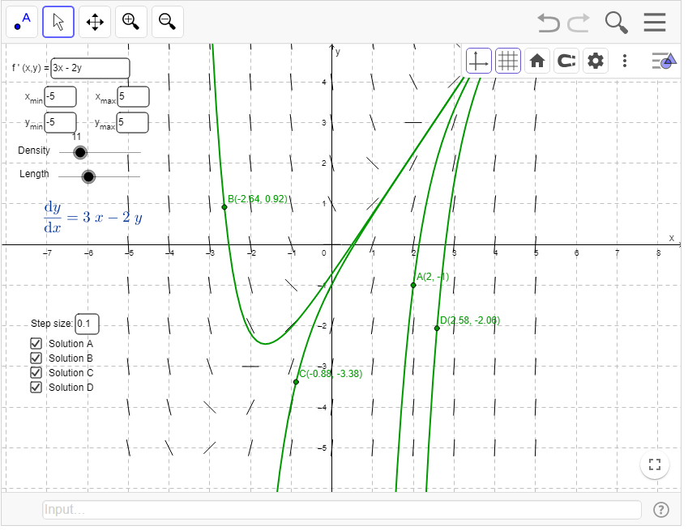

# Eulers Method - Ethan Harvey
## Basically, math: but we gave up.

### IM IN A HURRY WHAT DOES THE TABLE LOOK LIKE
It looks like this:

| x    | y     | $\frac{dy}{dx}$ | $\frac{dy}{dx}\Delta{x}$ | $y_{n}$ |
| ---- | ----- | --------------- | ------------------------ | ----- |
| 1    | 1     | 1               | .5                       | 1.5   |
| 1.25 | 1.5   | 2.5             | .625                     | 2.125 |
| 1.5  | 2.125 | 3               | .75                      | 2.875 |
| 1.75 | 2.875 | 3.5             | .875                     | 3.75  |
| 2    | 3.75  |                 |                          |       |

There you go.

### Ok so, what's this "euler method" thing

[Wikipedia](https://en.wikipedia.org/wiki/Euler_method) says:

> In [mathematics](https://en.wikipedia.org/wiki/Mathematics "Mathematics") and [computational science](https://en.wikipedia.org/wiki/Computational_science "Computational science"), the **Euler method** (also called **forward Euler method**) is a first-order [numerical](https://en.wikipedia.org/wiki/Numerical_analysis "Numerical analysis") procedure for solving [ordinary differential equations](https://en.wikipedia.org/wiki/Ordinary_differential_equation "Ordinary differential equation") (ODEs) with a given [initial value](https://en.wikipedia.org/wiki/Initial_value_problem "Initial value problem").

Which doesn't really help, because it's probably 2am (it is right now) and brain no work. So like, what do we actually do with it?

well, it's a method for approximating solutions to differential equations.

which im sure *really* helps

### Wait, so what exactly is a differential equation again? i kinda know, but its been awhile and it's a bit fuzzy...

Bascially, any equation where a derivative is set equal to some combination of x and y

Example:
$$\frac{dy}{dx}=3x-2y$$
And importantly, recall that when you solve these, you get a *function*. Remember slope fields? yeah, those. given a different starting position (basically, a point you have to hit), you get different functions

Okay, I'll get to the point now:

With Euler's method, you're pretty much saying: "I dont want to find the actual solution to this mess, so I'm just going to slowly *guess* at one"

You take a starting point, figure out the *direction* (aka slope) that your function is going in, take a tiny "step" in that direction, and then start the process again.

### Words make no sense, example needed

Let's say you're given this problem:
$$ \frac{dy}{dx} = 2x,\, y(1) = 1$$

> Approximate $y(2$) using a step size of $h = 0.25$

We've been told that at point $x=1$, $y=1$. 
That seems important, so let's write it down.

| x   | y   |
| --- | --- |
| 1   | 1   |

So, let's figure out the direction we're headed in at this point (slope). We take our points, $x=1$, $y=1$, and plug them into $\frac{dy}{dx}$. Doing this,

$$\frac{dy}{dx} = 2x = 2(1) = 2$$

Great, so we have a slope of 2 at this point. Add it to the table

| x   | y   | $\frac{dy}{dx}$ |
| --- | --- | -------------- |
| 1   | 1   | 2              |

So, that's our direction: a line with slope of 2. Now, we take a step in that direction by multiplying by our step size. (Recall step size, $\Delta{x} = .25$). Add it to the table.
$$\frac{dy}{dx}\Delta{x} = 2(.25) = .5$$

| x   | y   | $\frac{dy}{dx}$ | $\frac{dy}{dx}\Delta{x}$ |
| --- | --- | --------------- | ------------------------ |
| 1   | 1   | 2               | .5                      |

Finally, realize this: when multiplying $\frac{dy}{dx}\Delta{x}$, that's just showing you how much you've moved up from the original point. So, take that $\frac{dy}{dx}\Delta{x}$ and add it to your original position of $y=1$. This gives 
$$\frac{dy}{dx}\Delta{x}+y=.5+1=1.5$$
This is your *new $y$ position*. What you're saying is, if you move over $x$ by $.25$ (step size) to $x=1.25$, your $y$ will go to $1.5$. So, that's a whole new point: $(1.25, 1.5)$. Write it down!

| x    | y   | $\frac{dy}{dx}$ | $\frac{dy}{dx}\Delta{x}$ | $y_{new}$ |
| ---- | --- | --------------- | ------------------------ | ------- |
| 1    | 1   | 2               | .5                       | 1.5     |
| 1.25 | 1.5 |                 |                          |         |

Now, repeat! I won't tediously go through it all, but here's what the final table looks like:

| x    | y     | $\frac{dy}{dx}$ | $\frac{dy}{dx}\Delta{x}$ | $y_{n}$ |
| ---- | ----- | --------------- | ------------------------ | ----- |
| 1    | 1     | 2               | .5                       | 1.5   |
| 1.25 | 1.5   | 2.5             | .625                     | 2.125 |
| 1.5  | 2.125 | 3               | .75                      | 2.875 |
| 1.75 | 2.875 | 3.5             | .875                     | 3.75  |
| 2    | 3.75  |                 |                          |       |

So, your final answer is:

$$ y(2) \approx 3.75$$
Woo!

### That didn't help. Please let someone else explain

Alright, alright, I tried, ok? It took a lot of effort to format all of that...

Here's a nice [Khan Academy](https://www.khanacademy.org/math/ap-calculus-bc/bc-differential-equations-new/bc-7-5/v/eulers-method) video set, and another decent video by [The Organic Chemistry Tutor](https://www.youtube.com/watch?v=ukNbG7muKho) with some more examples. Their methods may differ some in how they look, but are doing the same thing.